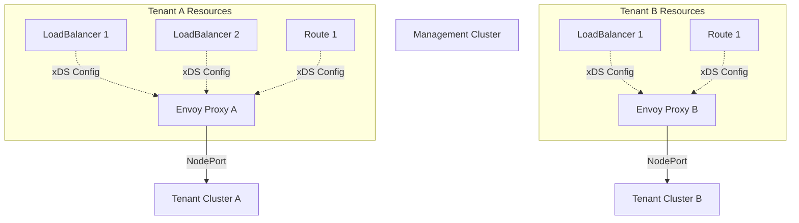
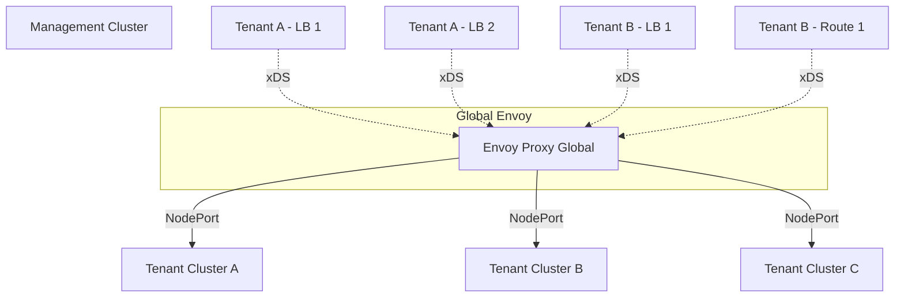
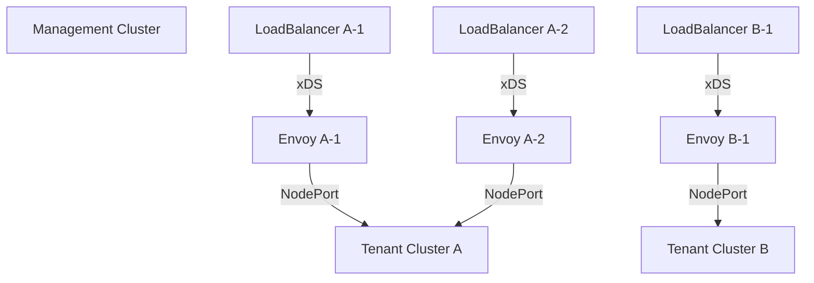

KubeLB uses Envoy proxy as its data plane for load balancing. The deployment topology determines how Envoy proxy instances are deployed and shared across tenants and services.

## Topology Overview

KubeLB supports three deployment topologies for Envoy proxy:

<CardGroup cols={3}>
  <Card title="Shared" icon="users" color="#10b981">
    One Envoy proxy per tenant cluster (Default)
  </Card>
  <Card title="Global" icon="globe" color="#f59e0b">
    One Envoy proxy for all tenant clusters (Deprecated)
  </Card>
  <Card title="Dedicated" icon="server" color="#ef4444">
    One Envoy proxy per service (Deprecated)
  </Card>
</CardGroup>

<Note>
**Current Status**: The `shared` topology is the only supported topology. The `dedicated` and `global` topologies are deprecated and will be removed in a future release. Both deprecated topologies now default to shared topology.
</Note>

## Shared Topology (Default)

In shared topology, a single Envoy proxy deployment is created for each tenant cluster. All services and routes from that tenant are configured to use this shared Envoy proxy.

### Architecture



### Benefits

<AccordionGroup>
  <Accordion title="Resource Efficiency">
    Significantly reduces resource consumption compared to dedicated topology. A single Envoy instance handles all traffic for a tenant.
  </Accordion>
  
  <Accordion title="Tenant Isolation">
    Each tenant has its own Envoy proxy, providing fault isolation. Issues in one tenant's traffic don't affect others.
  </Accordion>
  
  <Accordion title="Simplified Management">
    Fewer Envoy instances to monitor and maintain compared to dedicated topology.
  </Accordion>
  
  <Accordion title="Scalability">
    Easy to scale per tenant by adjusting replica count or using DaemonSet mode.
  </Accordion>
</AccordionGroup>

### Configuration

```yaml
apiVersion: kubelb.k8c.io/v1alpha1
kind: Config
metadata:
  name: kubelb
  namespace: kubelb
spec:
  envoyProxy:
    # Shared topology (default)
    topology: shared
    
    # Number of Envoy replicas per tenant
    replicas: 3
    
    # Use DaemonSet instead of Deployment
    useDaemonset: false
    
    # Ensure pods are spread across nodes
    singlePodPerNode: true
    
    # Resource requirements
    resources:
      requests:
        cpu: "500m"
        memory: "512Mi"
      limits:
        cpu: "2000m"
        memory: "2Gi"
```

### Deployment Modes

<Tabs>
  <Tab title="Deployment (Default)">
    Envoy runs as a Kubernetes Deployment with a configurable number of replicas.
    
    ```yaml
    envoyProxy:
      topology: shared
      replicas: 3
      useDaemonset: false
    ```
    
    **Use Cases:**
    - Clusters with specific capacity requirements
    - Fine-grained control over replica count
    - Clusters where not all nodes need Envoy
  </Tab>
  
  <Tab title="DaemonSet">
    Envoy runs as a DaemonSet with one pod per node.
    
    ```yaml
    envoyProxy:
      topology: shared
      useDaemonset: true
      # replicas field is ignored
    ```
    
    **Use Cases:**
    - High availability requirements
    - Maximum throughput across all nodes
    - Local traffic routing preferences
  </Tab>
</Tabs>

### Pod Distribution

Control how Envoy pods are distributed across nodes:

```yaml
envoyProxy:
  # Ensure only one pod per node (for Deployment mode)
  singlePodPerNode: true
  
  # Node selector for Envoy pods
  nodeSelector:
    node-role.kubernetes.io/worker: ""
  
  # Tolerations for tainted nodes
  tolerations:
    - key: "dedicated"
      operator: "Equal"
      value: "kubelb"
      effect: "NoSchedule"
  
  # Custom affinity rules
  affinity:
    podAntiAffinity:
      requiredDuringSchedulingIgnoredDuringExecution:
        - labelSelector:
            matchExpressions:
              - key: app
                operator: In
                values:
                  - envoy
          topologyKey: kubernetes.io/hostname
```

<Info>
When `singlePodPerNode: true`, KubeLB adds pod anti-affinity rules to prevent multiple Envoy pods on the same node.
</Info>

## Global Topology (Deprecated)

<Warning>
Global topology is deprecated and will be removed in a future release. It now defaults to shared topology.
</Warning>

In global topology, a single Envoy proxy deployment is shared across **all tenant clusters**.

### Architecture



### Why It's Deprecated

- **No Fault Isolation**: Issues in one tenant affect all tenants
- **Scaling Challenges**: Hard to scale for specific tenant needs
- **Resource Contention**: All tenants compete for the same Envoy resources
- **Configuration Complexity**: Large xDS snapshots with all tenant configurations

## Dedicated Topology (Deprecated)

<Warning>
Dedicated topology was deprecated in v1.1.0 and now defaults to shared topology.
</Warning>

In dedicated topology, a separate Envoy proxy deployment was created for **each LoadBalancer service**.

### Architecture



### Why It Was Deprecated

- **Resource Intensive**: Hundreds of Envoy instances for many services
- **Operational Overhead**: Too many deployments to monitor and maintain
- **Cost**: High resource consumption in the management cluster
- **Complexity**: Difficult to manage at scale

## Envoy xDS Configuration

Regardless of topology, KubeLB uses the Envoy xDS (Discovery Service) protocol to dynamically configure Envoy proxies.

### xDS Server

The KubeLB Manager hosts an xDS control plane server:

```go
// From internal/envoy/server.go
type Server struct {
    config        *v1alpha1.Config
    Cache         cachev3.SnapshotCache
    listenAddress string
    enableAdmin   bool
}
```

The xDS server:
- Listens on port 18000 (default)
- Implements Envoy's gRPC-based xDS APIs
- Maintains a snapshot cache of configurations
- Pushes updates to connected Envoy proxies

### Configuration Resources

KubeLB configures three main xDS resource types:

<Tabs>
  <Tab title="Listeners">
    Define ports that Envoy listens on:
    
    - **TCP Listener**: For Layer 4 TCP services
    - **UDP Listener**: For Layer 4 UDP services  
    - **HTTP Listener**: For Layer 7 HTTP/HTTPS traffic
    
    Each LoadBalancer service port gets a dedicated listener.
  </Tab>
  
  <Tab title="Clusters">
    Define upstream endpoints (tenant cluster nodes):
    
    - Endpoint addresses (node IPs)
    - Ports (NodePort)
    - Health check configuration
    - Load balancing policy (Round Robin)
    - Protocol settings (HTTP/1.1, HTTP/2, TCP, UDP)
  </Tab>
  
  <Tab title="Endpoints">
    Define the actual backend addresses:
    
    - Cluster load assignments
    - Endpoint addresses from tenant cluster nodes
    - Port mappings to NodePort
  </Tab>
</Tabs>

### Bootstrap Configuration

Each Envoy proxy starts with a bootstrap configuration that:

```go
// From internal/envoy/bootstrap.go
func (s *Server) GenerateBootstrap() string {
    cfg := &envoyBootstrap.Bootstrap{
        DynamicResources: &envoyBootstrap.Bootstrap_DynamicResources{
            LdsConfig: /* Listener Discovery Service */,
            CdsConfig: /* Cluster Discovery Service */,
        },
        StaticResources: &envoyBootstrap.Bootstrap_StaticResources{
            Listeners: [
                /* Readiness probe listener */,
                /* Health check listener */,
                /* Stats/metrics listener */,
            ],
            Clusters: [
                /* xDS cluster for control plane */,
                /* Admin cluster for local admin API */,
            ],
        },
        Admin: /* Admin interface configuration */,
    }
}
```

Static resources:
- **xDS Cluster**: Connects to KubeLB Manager's xDS server
- **Admin Listener**: Local admin interface (127.0.0.1:9001)
- **Stats Listener**: Prometheus metrics endpoint (port 19001)
- **Readiness Probe**: Health endpoint (port 19003)

### Dynamic Updates

When services change:

1. CCM detects change in tenant cluster
2. CCM updates LoadBalancer/Route CRD in management cluster
3. KubeLB Manager controller reconciles the change
4. Manager generates new xDS snapshot
5. xDS server pushes update to connected Envoy proxies
6. Envoy applies the configuration without restart

## High Availability

For production deployments, ensure high availability:

### Multiple Replicas

```yaml
envoyProxy:
  topology: shared
  replicas: 3  # Minimum recommended
  singlePodPerNode: true
```

### Pod Disruption Budget

KubeLB automatically creates a PodDisruptionBudget for Envoy deployments:

```yaml
apiVersion: policy/v1
kind: PodDisruptionBudget
metadata:
  name: envoy-tenant-a
spec:
  minAvailable: 2
  selector:
    matchLabels:
      app: envoy
      tenant: tenant-a
```

### Graceful Shutdown

Configure graceful shutdown to drain connections before termination:

```yaml
envoyProxy:
  gracefulShutdown:
    # Enable graceful shutdown
    disabled: false
    
    # Maximum time to drain connections
    drainTimeout: "60s"
    
    # Minimum time before checking connection count
    minDrainDuration: "5s"
    
    # Total grace period for pod termination
    terminationGracePeriodSeconds: 300
    
    # Shutdown manager sidecar image
    shutdownManagerImage: "docker.io/envoyproxy/gateway:v1.3.0"
```

With graceful shutdown enabled:
1. Pod receives TERM signal
2. Shutdown manager starts draining Envoy
3. Envoy stops accepting new connections
4. Existing connections are allowed to complete
5. After `drainTimeout` or when connections reach zero, Envoy exits

### Overload Manager

Protect Envoy from resource exhaustion:

```yaml
envoyProxy:
  overloadManager:
    # Enable overload protection
    enabled: true
    
    # Maximum heap size (bytes)
    maxHeapSizeBytes: 2147483648  # 2GB
    
    # Maximum concurrent connections
    maxActiveDownstreamConnections: 50000
```

Overload actions:
- **95% heap**: Start shrinking heap by freeing memory
- **98% heap**: Stop accepting new requests
- **Max connections**: Reject new connections

## Monitoring and Observability

### Metrics

Envoy exposes Prometheus metrics on port 19001:

```bash
curl http://envoy-pod:19001/stats/prometheus
```

Key metrics to monitor:
- `envoy_cluster_upstream_cx_active`: Active connections to upstreams
- `envoy_cluster_membership_healthy`: Healthy endpoints per cluster
- `envoy_listener_downstream_cx_total`: Total downstream connections
- `envoy_server_memory_allocated`: Memory usage

### Health Checks

Envoy provides multiple health endpoints:

- **Readiness**: `http://envoy:19003/ready` - Ready to accept traffic
- **Liveness**: `http://envoy:19004/healthz` - Envoy process is alive
- **Admin**: `http://127.0.0.1:9001/` - Admin interface (localhost only)

### Access Logs

Envoy logs all requests to stdout:

```
[2024-01-15T10:30:45.123Z] "GET / HTTP/1.1" 200 - 0 1234 5 3 "192.168.1.100" "curl/7.68.0" "req-id-123" "example.com" "10.0.1.5:30080"
```

Format includes:
- Timestamp
- Request method and path
- Response code
- Bytes sent/received  
- Duration
- Client IP
- Upstream host

## Troubleshooting

<AccordionGroup>
  <Accordion title="Envoy Pod Not Starting">
    Check:
    1. Bootstrap configuration is valid
    2. xDS server is reachable from the pod
    3. Resource requests/limits are not too restrictive
    4. Node selectors and tolerations are correctly configured
    
    ```bash
    kubectl logs -n kubelb envoy-tenant-a-xxx -c envoy
    ```
  </Accordion>
  
  <Accordion title="No xDS Configuration Updates">
    Verify:
    1. Envoy is connected to xDS server (check logs)
    2. LoadBalancer/Route CRDs exist in management cluster
    3. KubeLB Manager controller is running
    4. No errors in manager logs
    
    ```bash
    # Check xDS connections
    kubectl logs -n kubelb kubelb-manager-xxx | grep "gRPC connection"
    ```
  </Accordion>
  
  <Accordion title="High Memory Usage">
    Configure overload manager:
    
    ```yaml
    envoyProxy:
      overloadManager:
        enabled: true
        maxHeapSizeBytes: 2147483648
    ```
    
    Or increase resource limits:
    
    ```yaml
    envoyProxy:
      resources:
        limits:
          memory: "4Gi"
    ```
  </Accordion>
</AccordionGroup>

## Best Practices

<Steps>
  <Step title="Use Shared Topology">
    Always use shared topology for the best balance of resource efficiency and isolation.
  </Step>
  
  <Step title="Deploy Multiple Replicas">
    Run at least 3 Envoy replicas per tenant for high availability.
  </Step>
  
  <Step title="Enable Graceful Shutdown">
    Configure graceful shutdown to prevent connection drops during rolling updates.
  </Step>
  
  <Step title="Monitor Resource Usage">
    Set up monitoring and alerting for Envoy memory and CPU usage.
  </Step>
  
  <Step title="Use DaemonSet for Large Clusters">
    Consider DaemonSet mode for tenant clusters with many nodes.
  </Step>
</Steps>

## Next Steps

<CardGroup cols={2}>
  <Card title="Configuration Reference" icon="gear" href="/api/config">
    Complete Config CRD reference
  </Card>
  <Card title="Load Balancing" icon="scale-balanced" href="/concepts/load-balancing">
    Understand Layer 4 and Layer 7 load balancing
  </Card>
  <Card title="Monitoring" icon="chart-line" href="/operations/monitoring">
    Set up monitoring and metrics
  </Card>
  <Card title="Performance Tuning" icon="gauge-high" href="/operations/configuration">
    Optimize KubeLB performance
  </Card>
</CardGroup>