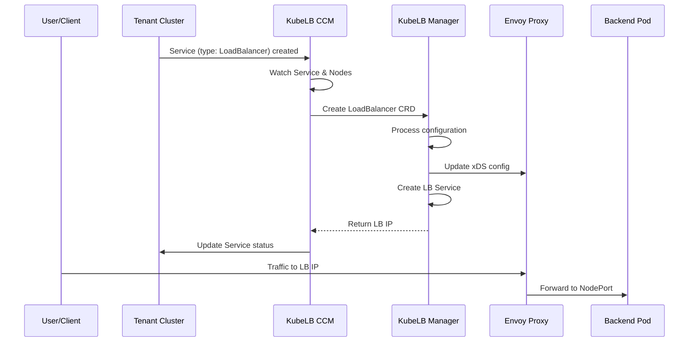
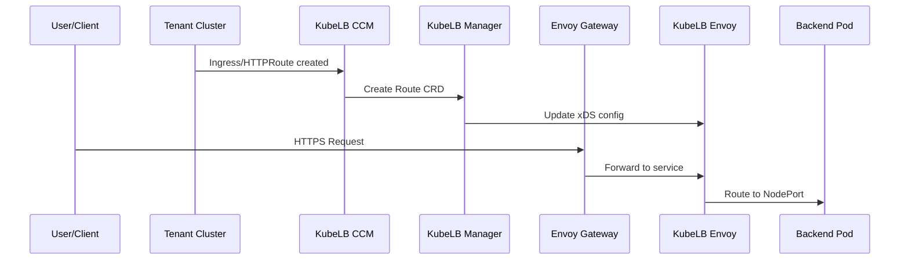

KubeLB implements a hub-and-spoke architecture to centrally manage load balancers across multiple Kubernetes clusters in multi-cloud and on-premise environments.

## Architecture Overview

The hub-and-spoke model consists of three main components:

<CardGroup cols={2}>
  <Card title="Management Cluster" icon="server">
    The central hub that hosts the KubeLB Manager and coordinates load balancing
  </Card>
  <Card title="Tenant Clusters" icon="network-wired">
    Consumer clusters that run the KubeLB CCM and workloads requiring load balancers
  </Card>
</CardGroup>

## Components

### KubeLB Manager (Hub)

The **KubeLB Manager** runs in the management cluster and serves as the central control plane. It is responsible for:

- Hosting the Envoy xDS (Extensible Discovery Service) control plane server
- Receiving load balancer configurations from tenant clusters via the `LoadBalancer` and `Route` CRDs
- Deploying and configuring Envoy proxy instances based on the selected topology
- Managing tenant registrations and multi-tenancy isolation
- Configuring load balancer services and routing rules

The manager implements the [envoy-control-plane](https://github.com/envoyproxy/go-control-plane) APIs to dynamically configure Envoy proxies using the xDS protocol.

<Note>
The manager runs in its own dedicated Kubernetes cluster, separate from your workload clusters. This ensures isolation and centralized management.
</Note>

### KubeLB CCM (Spoke)

The **KubeLB CCM (Cloud Controller Manager)** is deployed in each tenant cluster that requires load balancer services. It acts as a bridge between the tenant cluster and the management cluster.

Key responsibilities:

- Watches for Kubernetes `Service` resources of type `LoadBalancer`
- Watches for `Ingress` resources
- Watches for Gateway API resources (`Gateway`, `HTTPRoute`, `GRPCRoute`)
- Watches for node changes to track available endpoints
- Propagates load balancer configurations to the manager as `LoadBalancer` and `Route` CRDs
- Updates service status with assigned load balancer IPs

<Note>
The CCM is installed via Helm chart and requires API access to the management cluster.
</Note>

## Cluster Relationships

### Management Cluster

The management cluster is the central hub that:

- Hosts the KubeLB Manager controller
- Runs the Envoy xDS control plane server
- Deploys Envoy proxy instances (based on topology)
- Stores tenant configurations and load balancer state
- Must have a LoadBalancer implementation (cloud provider or MetalLB)

**Requirements:**
- Service type `LoadBalancer` support (cloud provider or self-managed like MetalLB)
- Network access to tenant cluster nodes on NodePort range (default: 30000-32767)

### Tenant Clusters

Tenant clusters are the consumer clusters where:

- Application workloads run
- Services require external load balancers
- KubeLB CCM is deployed
- Each cluster is registered as a `Tenant` resource in the management cluster

**Requirements:**
- Registered as a `Tenant` in the management cluster
- Network connectivity to the management cluster API server
- NodePort range accessible from the management cluster

## Communication Flow

### Layer 4 Load Balancing (Services)



### Layer 7 Load Balancing (Ingress/Gateway API)



## Data Plane Architecture

KubeLB uses Envoy proxy as the data plane for load balancing:

1. **Configuration Propagation**: CCM sends load balancer specs to the manager
2. **xDS Server**: Manager runs an xDS control plane that configures Envoy
3. **Dynamic Updates**: Envoy proxies receive configuration updates via xDS protocol
4. **Traffic Routing**: Envoy forwards traffic to tenant cluster NodePorts

<CodeGroup>
```yaml LoadBalancer CRD Example
apiVersion: kubelb.k8c.io/v1alpha1
kind: LoadBalancer
metadata:
  name: my-service
  namespace: tenant-ns
spec:
  type: LoadBalancer
  endpoints:
    - name: default
      addresses:
        - ip: "192.168.1.10"
        - ip: "192.168.1.11"
      ports:
        - name: http
          port: 30080
          protocol: TCP
  ports:
    - name: http
      port: 80
      protocol: TCP
```

```yaml Tenant Registration
apiVersion: kubelb.k8c.io/v1alpha1
kind: Tenant
metadata:
  name: production-cluster
spec:
  loadBalancer:
    class: "default"
  ingress:
    class: "nginx"
```
</CodeGroup>

## Benefits of Hub-and-Spoke Model

<AccordionGroup>
  <Accordion title="Centralized Management">
    All load balancer configurations are managed from a single control plane, simplifying operations and reducing overhead.
  </Accordion>
  
  <Accordion title="Multi-Cloud Support">
    Tenant clusters can run in different cloud providers or on-premise, while the management cluster handles load balancing.
  </Accordion>
  
  <Accordion title="Cost Optimization">
    Reduces the number of cloud load balancers needed by consolidating load balancing in the management cluster.
  </Accordion>
  
  <Accordion title="Consistent Configuration">
    Uniform load balancer behavior across all tenant clusters, regardless of underlying infrastructure.
  </Accordion>
</AccordionGroup>

## Network Requirements

<Warning>
Network connectivity is critical for the hub-and-spoke model to function properly.
</Warning>

Required network paths:

| Source | Destination | Port | Purpose |
|--------|-------------|------|----------|
| Tenant Cluster (CCM) | Management Cluster API | 6443 | API access to create CRDs |
| Management Cluster (Envoy) | Tenant Cluster Nodes | 30000-32767 | NodePort access for traffic routing |
| Envoy Proxy | Envoy xDS Server | 18000 | xDS configuration updates |
| Clients | Management Cluster (LoadBalancer) | 80/443 | Application traffic |

## Next Steps

<CardGroup cols={2}>
  <Card title="Multi-Tenancy" icon="users" href="/concepts/tenants">
    Learn about tenant isolation and namespace mapping
  </Card>
  <Card title="Load Balancing" icon="scale-balanced" href="/concepts/load-balancing">
    Understand Layer 4 and Layer 7 load balancing
  </Card>
  <Card title="Envoy Topology" icon="diagram-project" href="/concepts/envoy-topology">
    Explore different Envoy deployment topologies
  </Card>
  <Card title="Installation" icon="download" href="/installation/prerequisites">
    Install KubeLB in your environment
  </Card>
</CardGroup>