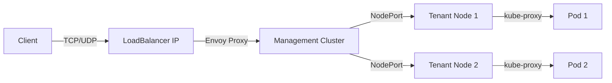
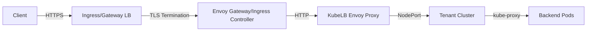

KubeLB provides both Layer 4 (TCP/UDP) and Layer 7 (HTTP/HTTPS) load balancing capabilities using Envoy proxy as the data plane.

## Load Balancing Layers

<CardGroup cols={2}>
  <Card title="Layer 4 - Transport" icon="network-wired">
    TCP and UDP load balancing for Kubernetes Services
  </Card>
  <Card title="Layer 7 - Application" icon="globe">
    HTTP/HTTPS load balancing for Ingress and Gateway API resources
  </Card>
</CardGroup>

## Layer 4 Load Balancing

Layer 4 load balancing operates at the transport layer, handling TCP and UDP traffic based on IP addresses and port numbers.

### Kubernetes Services

KubeLB automatically handles Kubernetes Services of type `LoadBalancer`. When you create such a service in a tenant cluster, the KubeLB CCM:

1. Detects the new LoadBalancer service
2. Collects node addresses and NodePort information
3. Creates a `LoadBalancer` CRD in the management cluster
4. KubeLB Manager provisions the load balancer and configures Envoy
5. Returns the external IP address to the tenant cluster

<CodeGroup>
```yaml TCP Service Example
apiVersion: v1
kind: Service
metadata:
  name: my-app
  namespace: default
spec:
  type: LoadBalancer
  selector:
    app: my-app
  ports:
    - name: http
      port: 80
      targetPort: 8080
      protocol: TCP
```

```yaml UDP Service Example
apiVersion: v1
kind: Service
metadata:
  name: dns-service
  namespace: kube-system
spec:
  type: LoadBalancer
  selector:
    app: dns
  ports:
    - name: dns
      port: 53
      targetPort: 53
      protocol: UDP
```
</CodeGroup>

### Protocol Support

KubeLB supports both TCP and UDP protocols:

- **TCP**: Web servers, databases, SSH, and most application protocols
- **UDP**: DNS, VoIP, gaming servers, and streaming protocols

<Note>
UDP health checks are not supported by Envoy. TCP health checks are automatically configured for TCP services.
</Note>

### LoadBalancer CRD

The `LoadBalancer` CRD represents a Layer 4 load balancer configuration in the management cluster:

```go
type LoadBalancerSpec struct {
    // Endpoints from tenant cluster nodes
    Endpoints []LoadBalancerEndpoints `json:"endpoints"`
    
    // Ports to expose on the load balancer
    Ports []LoadBalancerPort `json:"ports"`
    
    // Service type (ClusterIP, NodePort, LoadBalancer)
    Type corev1.ServiceType `json:"type"`
    
    // Traffic policy (Local or Cluster)
    ExternalTrafficPolicy corev1.ServiceExternalTrafficPolicy `json:"externalTrafficPolicy"`
    
    // Optional hostname for L7 exposure
    Hostname string `json:"hostname,omitempty"`
}
```

### Traffic Flow (Layer 4)



The traffic path:

1. Client connects to the LoadBalancer IP (provided by cloud provider or MetalLB)
2. Traffic hits the Envoy proxy in the management cluster
3. Envoy routes traffic to tenant cluster nodes via NodePort
4. Node's kube-proxy forwards traffic to backend pods

### External Traffic Policy

KubeLB supports both traffic policies:

<Tabs>
  <Tab title="Cluster (Default)">
    Traffic is distributed across all nodes in the cluster. This may cause an extra network hop but ensures better load distribution.
    
    ```yaml
    spec:
      externalTrafficPolicy: Cluster
    ```
  </Tab>
  
  <Tab title="Local">
    Traffic is only sent to nodes that have pods for the service. This preserves the client source IP and avoids extra hops.
    
    ```yaml
    spec:
      externalTrafficPolicy: Local
    ```
  </Tab>
</Tabs>

### Health Checks

KubeLB automatically configures TCP health checks for Layer 4 services:

```go
// Default health check configuration from internal/envoy/resource.go
defaultHealthCheck := []*envoyCore.HealthCheck{
    {
        Timeout:            5 seconds,
        Interval:           5 seconds,
        UnhealthyThreshold: 3,
        HealthyThreshold:   2,
        NoTrafficInterval:  5 seconds,
        HealthChecker: TcpHealthCheck{},
    },
}
```

<Info>
Health checks perform connect-only checks (no payload) to verify endpoint availability.
</Info>

## Layer 7 Load Balancing

Layer 7 load balancing operates at the application layer, making routing decisions based on HTTP headers, paths, hostnames, and other application-level data.

### Supported Resources

KubeLB supports multiple Layer 7 resource types:

<AccordionGroup>
  <Accordion title="Ingress">
    Kubernetes Ingress resources for HTTP/HTTPS routing.
    
    ```yaml
    apiVersion: networking.k8s.io/v1
    kind: Ingress
    metadata:
      name: my-ingress
    spec:
      rules:
        - host: example.com
          http:
            paths:
              - path: /
                pathType: Prefix
                backend:
                  service:
                    name: my-service
                    port:
                      number: 80
    ```
  </Accordion>
  
  <Accordion title="Gateway API - HTTPRoute">
    Gateway API HTTPRoute for advanced HTTP routing.
    
    ```yaml
    apiVersion: gateway.networking.k8s.io/v1
    kind: HTTPRoute
    metadata:
      name: my-route
    spec:
      parentRefs:
        - name: my-gateway
      rules:
        - backendRefs:
            - name: my-service
              port: 80
    ```
  </Accordion>
  
  <Accordion title="Gateway API - GRPCRoute">
    Gateway API GRPCRoute for gRPC services.
    
    ```yaml
    apiVersion: gateway.networking.k8s.io/v1alpha2
    kind: GRPCRoute
    metadata:
      name: grpc-route
    spec:
      parentRefs:
        - name: my-gateway
      rules:
        - backendRefs:
            - name: grpc-service
              port: 9000
    ```
  </Accordion>
</AccordionGroup>

### Route CRD

Layer 7 configurations are represented by the `Route` CRD in the management cluster:

```go
type RouteSpec struct {
    // Endpoints from tenant cluster nodes
    Endpoints []LoadBalancerEndpoints `json:"endpoints"`
    
    // Source configuration from Kubernetes resources
    Source RouteSource `json:"source"`
}

type RouteSource struct {
    Kubernetes *KubernetesSource `json:"kubernetes"`
}

type KubernetesSource struct {
    // The original Ingress/HTTPRoute/GRPCRoute resource
    Route unstructured.Unstructured `json:"resource"`
    
    // Associated backend services
    Services []UpstreamService `json:"services"`
}
```

### Traffic Flow (Layer 7)



The Layer 7 traffic path:

1. Client makes HTTPS request to Ingress/Gateway LoadBalancer
2. Envoy Gateway or Ingress Controller terminates TLS
3. Traffic is forwarded to KubeLB Envoy proxy service
4. KubeLB Envoy routes to tenant cluster NodePort
5. Tenant cluster forwards to backend pods

<Note>
KubeLB acts as a transparent proxy for Layer 7 traffic. TLS termination is handled by the Ingress Controller or Envoy Gateway in the management cluster.
</Note>

### Protocol Handling

KubeLB automatically configures the appropriate protocol based on route type:

<Tabs>
  <Tab title="HTTP/Ingress">
    Uses HTTP/1.1 for Ingress and HTTPRoute resources. Envoy HTTP Connection Manager is configured with:
    
    - Automatic HTTP/1.1 protocol
    - Request ID generation
    - X-Forwarded-For header handling
    - Idle timeout (60s)
  </Tab>
  
  <Tab title="gRPC">
    Uses HTTP/2 for GRPCRoute resources. Configured with:
    
    - HTTP/2 protocol options
    - Bidirectional streaming support
    - Maximum concurrent streams
  </Tab>
</Tabs>

### Hostname-Based Load Balancing

KubeLB supports hostname-based exposure for LoadBalancer services:

```yaml
apiVersion: kubelb.k8c.io/v1alpha1
kind: LoadBalancer
metadata:
  name: my-service
spec:
  hostname: myapp.example.com
  endpoints:
    - name: default
      addresses:
        - ip: "192.168.1.10"
      ports:
        - name: http
          port: 30080
          protocol: TCP
```

When a hostname is specified, KubeLB:

1. Creates a Route (Ingress or HTTPRoute) for the hostname
2. Exposes the service over HTTP/HTTPS with TLS
3. Can automatically create DNS records (if configured)
4. Can provision TLS certificates (if cert-manager is available)

## Load Balancing Algorithms

KubeLB uses Envoy's load balancing algorithms. The default is **Round Robin**:

```go
cluster := &envoyCluster.Cluster{
    LbPolicy: envoyCluster.Cluster_ROUND_ROBIN,
    // ...
}
```

Envoy distributes requests evenly across healthy endpoints.

## Health and Readiness

### Endpoint Health

KubeLB configures health checks to ensure traffic is only sent to healthy endpoints:

- **TCP Services**: Connect-only TCP health checks
- **UDP Services**: No health checks (Envoy limitation)
- **HTTP Services**: HTTP health checks can be configured via Envoy Gateway/Ingress Controller

### Unhealthy Threshold

Endpoints are marked unhealthy after:
- 3 consecutive failed health checks
- 5-second interval between checks
- 5-second timeout per check

### Panic Threshold

KubeLB sets the panic threshold to 0%, meaning Envoy will continue routing to all endpoints even if all are marked unhealthy:

```go
CommonLbConfig: &envoyCluster.Cluster_CommonLbConfig{
    HealthyPanicThreshold: &envoytypev3.Percent{Value: 0},
}
```

<Warning>
With panic threshold at 0%, Envoy will route traffic even to unhealthy endpoints to prevent complete service failure.
</Warning>

## Advanced Features

### Proxy Protocol

KubeLB supports PROXY protocol v2 for preserving client IP addresses:

```yaml
apiVersion: v1
kind: Service
metadata:
  name: my-app
  annotations:
    kubelb.k8c.io/proxy-protocol: "v2"
spec:
  type: LoadBalancer
  # ...
```

When enabled, Envoy adds PROXY protocol headers before forwarding traffic.

### Connection Management

KubeLB configures connection limits to prevent resource exhaustion:

- **Max concurrent streams**: 1,000,000 for gRPC connections
- **Buffer limits**: 32KB per connection
- **Circuit breakers**: Configurable connection and request limits
- **TCP keepalive**: Enabled for xDS connections

## Performance Considerations

<AccordionGroup>
  <Accordion title="Endpoint Count">
    KubeLB can handle thousands of endpoints across multiple clusters. The xDS server efficiently pushes updates only when configurations change.
  </Accordion>
  
  <Accordion title="Connection Pooling">
    Envoy maintains connection pools to backend services, reducing latency and improving throughput.
  </Accordion>
  
  <Accordion title="HTTP/2 for xDS">
    The xDS control plane uses HTTP/2 for efficient, multiplexed configuration updates to Envoy proxies.
  </Accordion>
  
  <Accordion title="Incremental xDS">
    Envoy receives only the configuration changes that affect it, not the entire configuration every time.
  </Accordion>
</AccordionGroup>

## Next Steps

<CardGroup cols={2}>
  <Card title="Envoy Topology" icon="diagram-project" href="/concepts/envoy-topology">
    Learn about Envoy proxy deployment topologies
  </Card>
  <Card title="Multi-Tenancy" icon="users" href="/concepts/tenants">
    Understand tenant isolation and configuration
  </Card>
  <Card title="Layer 4 Guide" icon="network-wired" href="/guides/layer4-services">
    Configure Layer 4 load balancing
  </Card>
  <Card title="Layer 7 Guide" icon="globe" href="/guides/layer7-routing">
    Set up Ingress and Gateway API
  </Card>
</CardGroup>