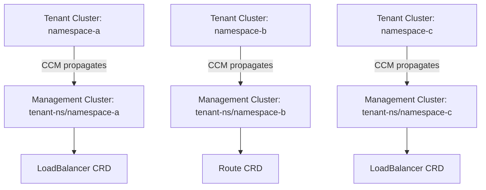
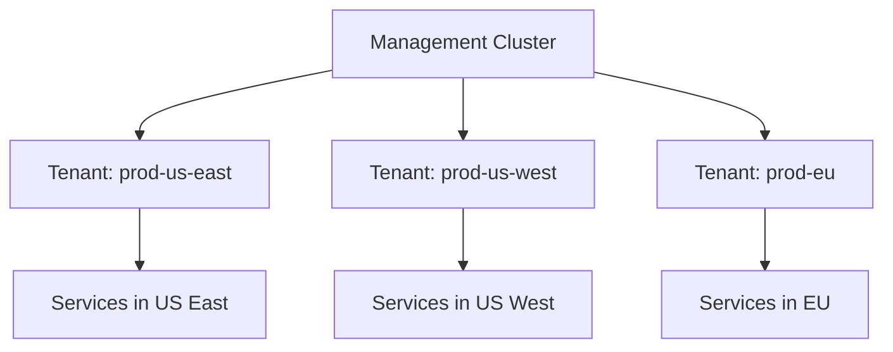
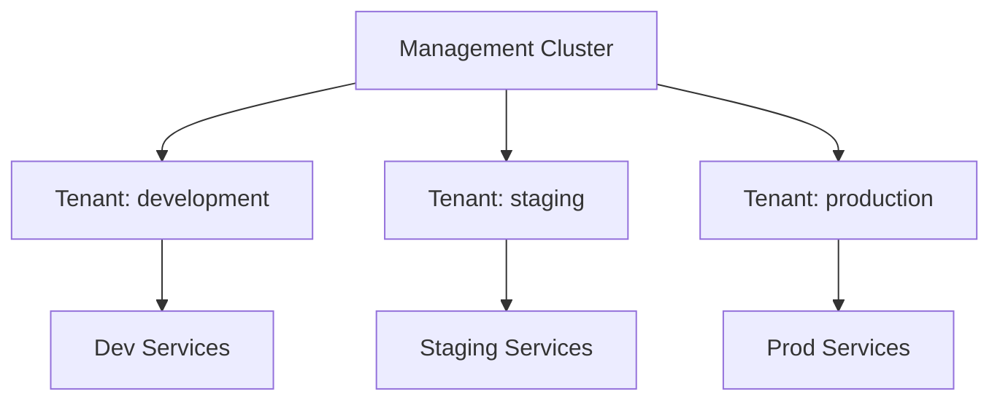
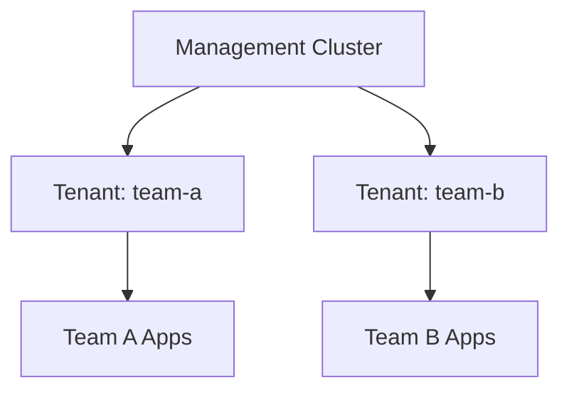

KubeLB provides robust multi-tenancy support, allowing multiple tenant clusters to share a single management cluster while maintaining isolation and independent configuration.

## Tenant Model

In KubeLB, a **tenant** represents a single consumer cluster that uses the centralized load balancing services. Each tenant cluster:

- Is registered as a `Tenant` CRD in the management cluster
- Has its own namespace in the management cluster
- Maintains isolated load balancer configurations
- Can have custom settings and policies

<CardGroup cols={2}>
  <Card title="Isolation" icon="shield">
    Each tenant's resources are isolated in separate namespaces
  </Card>
  <Card title="Configuration" icon="sliders">
    Tenants can have custom load balancer and routing policies
  </Card>
  <Card title="Security" icon="lock">
    RBAC ensures tenants can only access their own resources
  </Card>
  <Card title="Scalability" icon="arrows-maximize">
    Support for hundreds of tenant clusters
  </Card>
</CardGroup>

## Tenant Resource

The `Tenant` CRD is a cluster-scoped resource that defines a tenant's configuration:

```go
type TenantSpec struct {
    // Annotation settings for propagation and defaults
    AnnotationSettings `json:",inline"`
    
    // Layer 4 load balancer settings
    LoadBalancer LoadBalancerSettings `json:"loadBalancer"`
    
    // Ingress configuration
    Ingress IngressSettings `json:"ingress"`
    
    // Gateway API configuration
    GatewayAPI GatewayAPISettings `json:"gatewayAPI"`
    
    // DNS settings for hostname-based load balancing
    DNS DNSSettings `json:"dns"`
    
    // Certificate management settings
    Certificates CertificatesSettings `json:"certificates"`
}
```

### Creating a Tenant

<Steps>
  <Step title="Register Tenant in Management Cluster">
    Create a `Tenant` resource in the management cluster:
    
    ```yaml
    apiVersion: kubelb.k8c.io/v1alpha1
    kind: Tenant
    metadata:
      name: production-cluster
    spec:
      loadBalancer:
        class: "default"
      ingress:
        class: "nginx"
        disable: false
      gatewayAPI:
        class: "envoy-gateway"
        disable: false
      dns:
        wildcardDomain: "*.prod.example.com"
        allowExplicitHostnames: true
    ```
  </Step>
  
  <Step title="Create Namespace">
    The KubeLB Manager automatically creates a namespace for the tenant. The namespace name typically matches the tenant name.
  </Step>
  
  <Step title="Configure CCM">
    Install the KubeLB CCM in the tenant cluster with credentials to access the management cluster:
    
    ```yaml
    kubelb:
      tenantName: production-cluster
      managerNamespace: production-cluster
      managerHost: https://kubelb-manager.example.com:6443
    ```
  </Step>
</Steps>

## Namespace Mapping

KubeLB uses a namespace mapping strategy to isolate tenant resources:



### Resource Organization

When a tenant cluster creates resources:

1. **Tenant Cluster**: Service created in namespace `app-namespace`
2. **Management Cluster**: LoadBalancer CRD created in `tenant-name` namespace
3. **Resource Labels**: Original namespace is preserved in labels:
   ```yaml
   labels:
     kubelb.k8c.io/origin-name: my-service
     kubelb.k8c.io/origin-ns: app-namespace
     kubelb.k8c.io/tenant: production-cluster
   ```

<Info>
The namespace in the management cluster corresponds to the tenant, not the original namespace in the tenant cluster.
</Info>

## Tenant Configuration

### Load Balancer Settings

Configure Layer 4 load balancing behavior:

```yaml
spec:
  loadBalancer:
    # Load balancer class to use (optional)
    class: "default"
    
    # Disable L4 load balancing for this tenant
    disable: false
```

<Tabs>
  <Tab title="Enable (Default)">
    ```yaml
    loadBalancer:
      class: "default"
      disable: false
    ```
    
    Services of type LoadBalancer will be processed and load balancers will be created.
  </Tab>
  
  <Tab title="Disable">
    ```yaml
    loadBalancer:
      disable: true
    ```
    
    All LoadBalancer services in this tenant will be ignored by KubeLB.
  </Tab>
</Tabs>

### Ingress Settings

Configure Ingress resource handling:

```yaml
spec:
  ingress:
    # Ingress class to use
    class: "nginx"
    
    # Disable Ingress for this tenant
    disable: false
```

### Gateway API Settings

Configure Gateway API support:

```yaml
spec:
  gatewayAPI:
    # Gateway class to use
    class: "envoy-gateway"
    
    # Default gateway reference for routes
    defaultGateway:
      name: default-gateway
      namespace: kubelb
    
    # Disable Gateway API for this tenant
    disable: false
```

<Note>
The `defaultGateway` field specifies which Gateway in the management cluster should be used for this tenant's routes.
</Note>

### DNS Configuration

Configure DNS automation for hostname-based load balancing:

```yaml
spec:
  dns:
    # Wildcard domain for automatic DNS record creation
    wildcardDomain: "*.tenant.example.com"
    
    # Allow explicit hostnames (not just wildcard subdomains)
    allowExplicitHostnames: true
    
    # Add DNS annotations to generated DNS records
    useDNSAnnotations: true
    
    # Add certificate annotations
    useCertificateAnnotations: true
```

<AccordionGroup>
  <Accordion title="Wildcard Domain">
    When set, services can request hostnames under this domain:
    
    ```yaml
    # Service in tenant cluster
    apiVersion: kubelb.k8c.io/v1alpha1
    kind: LoadBalancer
    spec:
      hostname: myapp.tenant.example.com  # Under wildcard domain
    ```
  </Accordion>
  
  <Accordion title="Explicit Hostnames">
    When `allowExplicitHostnames: true`, services can use any hostname:
    
    ```yaml
    spec:
      hostname: custom.external.com  # Outside wildcard domain
    ```
  </Accordion>
</AccordionGroup>

### Certificate Settings

Configure automatic TLS certificate provisioning:

```yaml
spec:
  certificates:
    # Default cert-manager ClusterIssuer for certificates
    defaultClusterIssuer: "letsencrypt-prod"
```

When a LoadBalancer has a hostname, KubeLB can automatically:
1. Create a Certificate resource using cert-manager
2. Request a certificate from the specified ClusterIssuer
3. Configure TLS on the generated Route/Ingress

## Annotation Propagation

Tenants can control which annotations are propagated from the tenant cluster to the management cluster:

### Propagate Specific Annotations

```yaml
spec:
  propagatedAnnotations:
    "external-dns.alpha.kubernetes.io/hostname": ""
    "metallb.universe.tf/address-pool": "production"
    "cert-manager.io/cluster-issuer": ""
```

- Empty value means any value is allowed
- Specific value means only that value is propagated

### Propagate All Annotations

```yaml
spec:
  propagateAllAnnotations: true
```

<Warning>
Be cautious when propagating all annotations, as this may expose sensitive information or cause unintended behavior.
</Warning>

### Default Annotations

Set default annotations that will be added to resources if not present:

```yaml
spec:
  defaultAnnotations:
    all:
      "kubelb.k8c.io/managed": "true"
    service:
      "metallb.universe.tf/address-pool": "default"
    ingress:
      "cert-manager.io/cluster-issuer": "letsencrypt-prod"
```

Annotation targets:
- `all`: Applied to all resources
- `service`: LoadBalancer services only
- `ingress`: Ingress resources only
- `gateway`, `httproute`, `grpcroute`, etc.: Specific Gateway API resources

## Tenant Isolation

### Resource Isolation

KubeLB ensures strict resource isolation between tenants:

<Steps>
  <Step title="Namespace Separation">
    Each tenant's resources are created in a dedicated namespace in the management cluster.
  </Step>
  
  <Step title="Label Filtering">
    Resources are labeled with tenant information and filtered by controllers:
    ```yaml
    labels:
      kubelb.k8c.io/tenant: production-cluster
    ```
  </Step>
  
  <Step title="RBAC Enforcement">
    KubeLB CCM in tenant clusters can only create/update resources in their assigned namespace.
  </Step>
</Steps>

### Configuration Isolation

Tenant-specific configurations are isolated:

```yaml
# Tenant A: Uses MetalLB pool "tenant-a"
apiVersion: kubelb.k8c.io/v1alpha1
kind: Tenant
metadata:
  name: tenant-a
spec:
  defaultAnnotations:
    service:
      "metallb.universe.tf/address-pool": "tenant-a"
```

```yaml
# Tenant B: Uses MetalLB pool "tenant-b"
apiVersion: kubelb.k8c.io/v1alpha1
kind: Tenant
metadata:
  name: tenant-b
spec:
  defaultAnnotations:
    service:
      "metallb.universe.tf/address-pool": "tenant-b"
```

### Envoy Configuration Isolation

With **shared topology** (default), each tenant gets its own Envoy proxy deployment, providing:

- Isolated data plane per tenant
- Independent scaling per tenant
- Tenant-specific resource limits
- Fault isolation (one tenant's traffic issues don't affect others)

See [Envoy Topology](/concepts/envoy-topology) for more details.

## Multi-Cluster Scenarios

### Scenario 1: Multiple Production Clusters



Each region has its own tenant configuration with region-specific settings.

### Scenario 2: Environment Separation



Different tenants for dev, staging, and production environments with different policies.

### Scenario 3: Team-Based Isolation



Each team manages their own cluster with independent load balancing configuration.

## Configuration Precedence

When both global Config and Tenant configurations exist, tenant settings take precedence:

1. **Tenant Configuration** (highest priority)
2. **Global Config** (fallback)
3. **Default Values** (lowest priority)

Example:

```yaml
# Global Config
apiVersion: kubelb.k8c.io/v1alpha1
kind: Config
metadata:
  name: default
spec:
  loadBalancer:
    class: "default"
  dns:
    wildcardDomain: "*.global.example.com"
```

```yaml
# Tenant Config (overrides global)
apiVersion: kubelb.k8c.io/v1alpha1
kind: Tenant
metadata:
  name: production
spec:
  dns:
    wildcardDomain: "*.prod.example.com"  # Overrides global
  # loadBalancer.class inherited from global Config
```

## Best Practices

<AccordionGroup>
  <Accordion title="Namespace Strategy">
    Use consistent naming for tenant namespaces. For example, prefix with team or environment name: `team-frontend`, `env-production`.
  </Accordion>
  
  <Accordion title="Resource Quotas">
    Consider setting resource quotas on tenant namespaces in the management cluster to prevent resource exhaustion.
  </Accordion>
  
  <Accordion title="Annotation Policies">
    Define clear policies for which annotations should be propagated. Avoid propagating all annotations unless necessary.
  </Accordion>
  
  <Accordion title="Security">
    Use dedicated service accounts for each tenant's CCM with minimal required permissions (RBAC).
  </Accordion>
  
  <Accordion title="Monitoring">
    Set up tenant-specific monitoring and alerting to track resource usage and performance per tenant.
  </Accordion>
</AccordionGroup>

## Disabling Features Per Tenant

You can selectively disable features for specific tenants:

```yaml
apiVersion: kubelb.k8c.io/v1alpha1
kind: Tenant
metadata:
  name: legacy-cluster
spec:
  # Disable Layer 4 load balancing
  loadBalancer:
    disable: true
  
  # Enable Ingress
  ingress:
    class: "nginx"
    disable: false
  
  # Disable Gateway API
  gatewayAPI:
    disable: true
```

Use cases:
- Legacy clusters that only use Ingress
- Clusters that manage their own load balancers
- Gradual migration scenarios

## Next Steps

<CardGroup cols={2}>
  <Card title="Envoy Topology" icon="diagram-project" href="/concepts/envoy-topology">
    Learn how Envoy proxies are deployed per tenant
  </Card>
  <Card title="Configuration" icon="gear" href="/api/config">
    Global Config CRD reference
  </Card>
  <Card title="Installation" icon="download" href="/installation/prerequisites">
    Install and configure KubeLB
  </Card>
  <Card title="RBAC" icon="lock" href="/security/tenant-isolation">
    Configure role-based access control
  </Card>
</CardGroup>